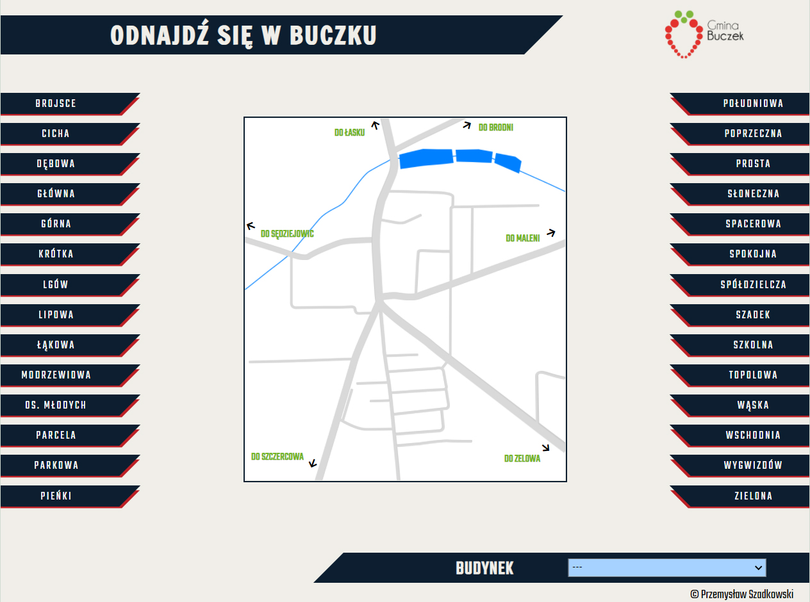

# map_of_buczek_new
> Map of my town - Buczek. In a simply way you can find any street and important building in Buczek.

## Table of contents
* [Colors key](#colors-key)
* [General info](#general-info)
* [Screenshots](#screenshots)
* [Technologies](#technologies)
* [Features](#features)
* [Inspiration](#inspiration)
* [Contact](#contact)

## Colors-key

## General info

I decided to build app which helps to find streets in my town. Then I added main buldings. This project was one of my first bigger web projects. The biggest issue was to add two streets, far from main map. But I made extra map and simple animation - so when street Szadek and Wygwizdow is clicked, new map shows up.

## Screenshots

### Desktop view

### Mobile view

## Technologies
* HTML
* CSS
* Javascript

## Features

Live demo https://przemek-szadkowski.github.io/map_of_buczek_new/

## Status
Project is: finished

## Inspiration
Project inspired by my friend who don't remember streets in my town.

## Contact
Created by [przemoszadkowski@o2.pl](mailto:user@example.com) - feel free to contact me!